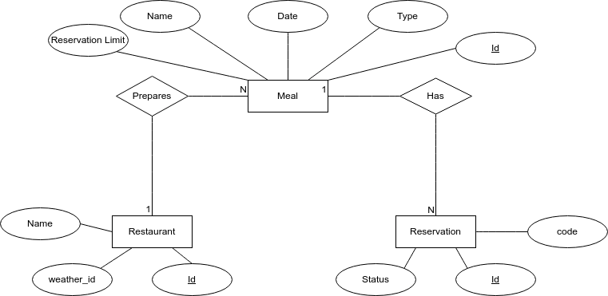
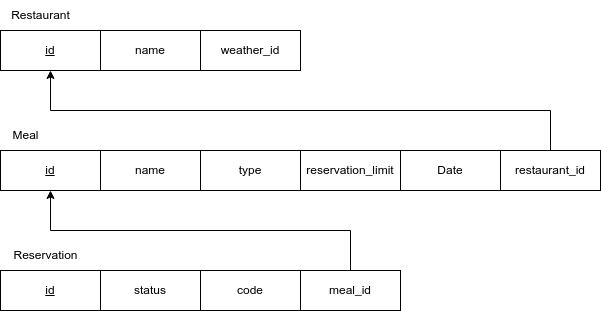

# Notes from developing the homework

## How to run
- Run MySQL Container on root folder
```
docker compose up -d 
```

- Run WebApp on root folder
```
mvn spring-boot:run
```

## Other Stuff
Spring Boot project initialization dependencies.


I will use Thymeleaf for frontend.


## Models

### DER



## ER


