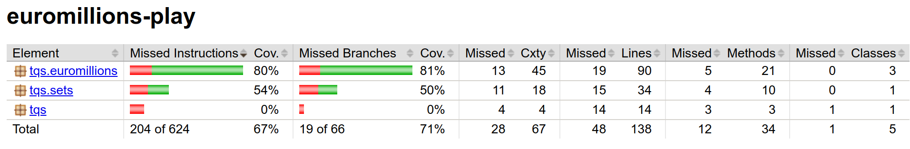
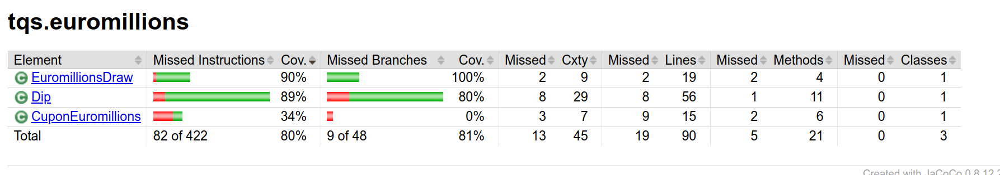
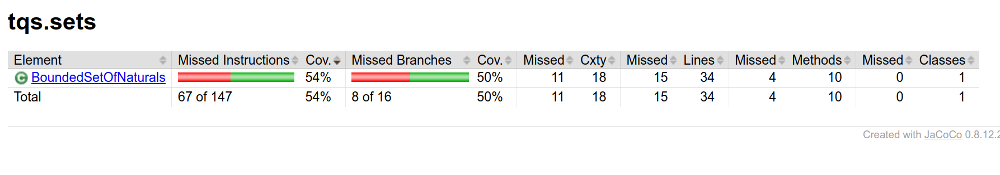
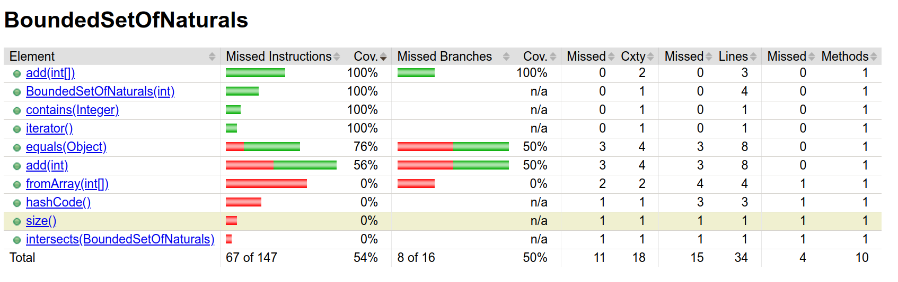
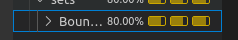
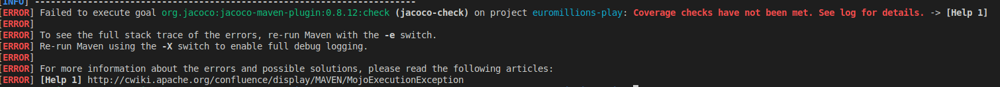

## 1.2

#### c

Coverage results:


Coverage results of euromillions class:


Coverage resuts of sets class:


Classes that offer less coverage:
- sets: BoundedSetOfNaturals (54%)
- euromillions: CuponEuromillions (0%)

Methods that offer less coverage:
- CuponEuroMillions: format() and countDips() -> no unit tests.
- Dip: hashCode() -> no unit tests, and equals().
- EuromillionsDraw: generateRandomDraw() and getDrawResults() -> no unit tests.
- BoundedSetOfNaturals: fromArray(), hashCode(), size(), intersects() -> no unit tests. add() and equals().


#### BoundedSetOfNaturals
BoundedSetOfNaturals class has a coverage of 54% and only 50% of the decision branches (if statments) are being covered.
The methods fromArray(), hashCode(), size(), intersects() have no unit tests. The methods add() and equals() have respectivelly 56% and 76% of coverage and 50% both of branches covered.




#### d
coverage results for BoundedSetOfNaturals after tests fix: 80%




#### e

- Before:

The methods fromArray(), hashCode(), size(), intersects() have no unit tests. The methods add() and equals() have respectivelly 56% and 76% of coverage and 50% both of branches covered.

- After


#### f
```
<build>
    <plugins>
        <!-- Note that JUnit 5 requires Surefire version 2.22.1 or higher -->
        <plugin>
            <artifactId>maven-surefire-plugin</artifactId>
            <version>${surefire-plugin-version}</version>
        </plugin>
        <plugin>
            <artifactId>maven-failsafe-plugin</artifactId>
            <version>${surefire-plugin-version}</version>
        </plugin>
        <!-- Jacoco runner to inspect code coverage -->
        <plugin>
            <groupId>org.jacoco</groupId>
            <artifactId>jacoco-maven-plugin</artifactId>
            <version>${jacoco-maven-plugin.version}</version>
            <executions>
                <execution>
                    <goals>
                        <goal>prepare-agent</goal>
                    </goals>
                </execution>
                <execution>
                    <id>report</id>
                    <phase>test</phase>
                    <goals>
                        <goal>report</goal>
                    </goals>
                </execution>
                <execution>
                    <id>jacoco-check</id>
                    <phase>test</phase>
                    <goals>
                        <goal>check</goal>
                    </goals>
                    <configuration>
                        <rules>
                            <rule>
                                <element>CLASS</element>
                                <limits>
                                    <limit>
                                        <counter>LINE</counter>
                                        <value>COVEREDRATIO</value>
                                        <minimum>0.90</minimum>
                                    </limit>
                                </limits>
                            </rule>
                        </rules>
                    </configuration>
                </execution>
            </executions>
        </plugin>
    </plugins>
</build>
```




#### g