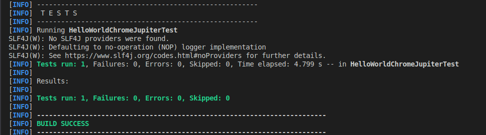

### Notes

#### a)

#### b)
also tests passed.

i need to add the method click to move to the calculator page: driver.findElement(By.linkText("Slow calculator")).click();

#### c) 
check the code, to verify the web driver dependency injection method

all tests passed
