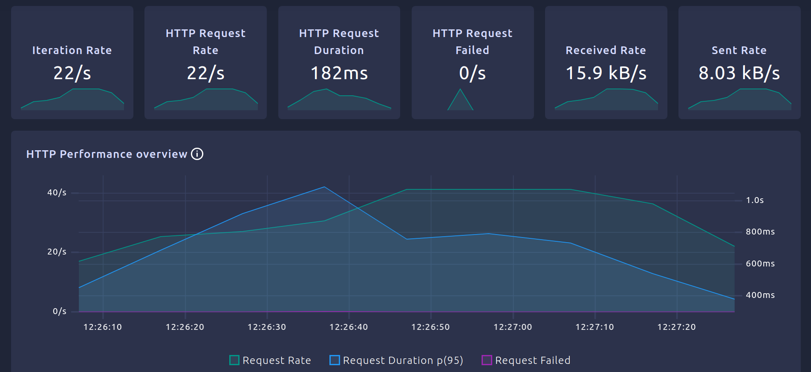
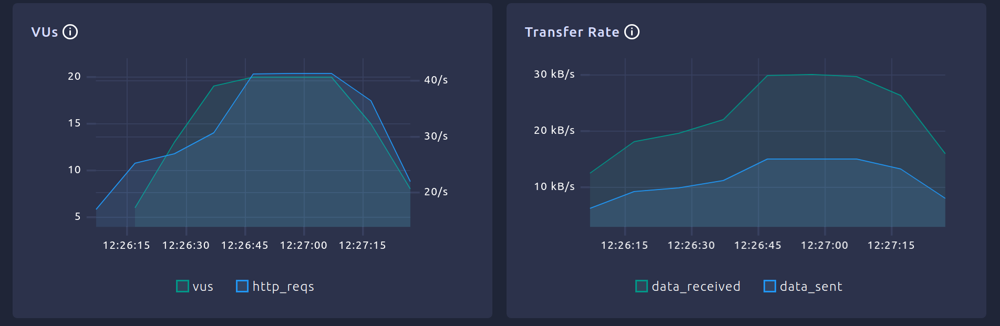
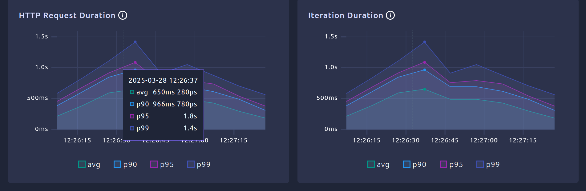
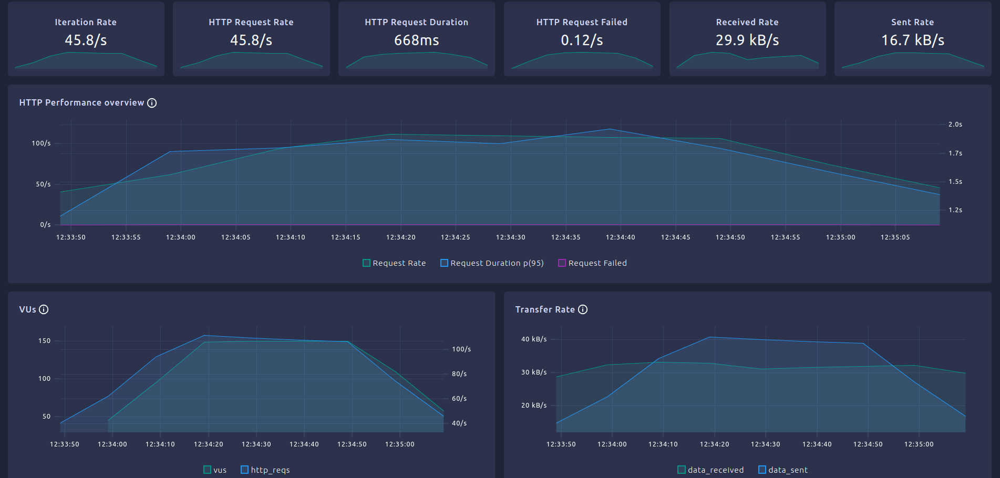
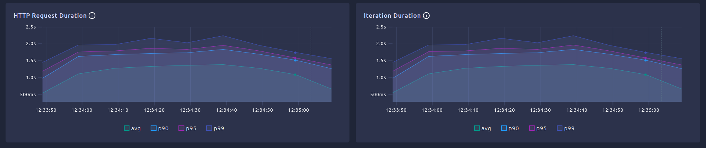
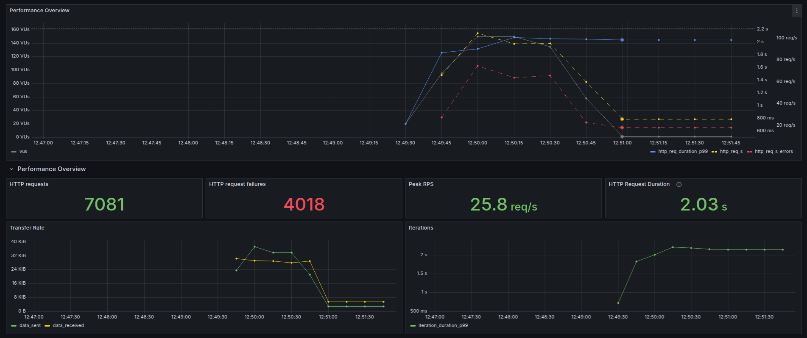
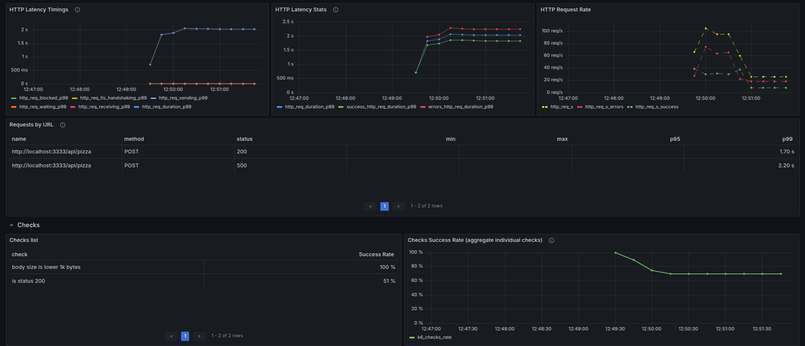

# Notes Exercise 2

## a)
Load tests results:
```
  █ TOTAL RESULTS 

    HTTP
    http_req_duration.......................................................: avg=290.21ms min=31.29ms med=276.65ms max=840.47ms p(90)=486.83ms p(95)=580.07ms
      { expected_response:true }............................................: avg=290.21ms min=31.29ms med=276.65ms max=840.47ms p(90)=486.83ms p(95)=580.07ms
    http_req_failed.........................................................: 0.00%  0 out of 1052
    http_reqs...............................................................: 1052   52.512899/s

    EXECUTION
    iteration_duration......................................................: avg=290.62ms min=31.9ms  med=276.95ms max=841ms    p(90)=487.14ms p(95)=580.54ms
    iterations..............................................................: 1052   52.512899/s
    vus.....................................................................: 1      min=1         max=20
    vus_max.................................................................: 20     min=20        max=20

    NETWORK
    data_received...........................................................: 759 kB 38 kB/s
    data_sent...............................................................: 384 kB 19 kB/s


running (20.0s), 00/20 VUs, 1052 complete and 0 interrupted iterations
default ✓ [======================================] 00/20 VUs  20s
```

API Calls Time:
- Average: 290.21ms
- Minimum: 31.29ms
- Maximum: 840.47ms

Requests made: 1052

Requests faile: 0

## c) 
thresholds: https://grafana.com/docs/k6/latest/using-k6/thresholds/

thresholds applied:
```
thresholds: {
        http_req_duration: ['p(95)<1100'], // 95% of requests should be below 1100ms
        http_req_failed: ['rate<0.01'], 
    },
```

test results
```
 █ TOTAL RESULTS 

    HTTP
    http_req_duration.......................................................: avg=512.72ms min=27.98ms med=488.46ms max=1.61s p(90)=845.69ms p(95)=971.68ms
      { expected_response:true }............................................: avg=510.38ms min=27.98ms med=487.47ms max=1.6s  p(90)=842.94ms p(95)=956.36ms
    http_req_failed.........................................................: 0.25%  6 out of 2375
    http_reqs...............................................................: 2375   26.379655/s

    EXECUTION
    iteration_duration......................................................: avg=513.14ms min=28.26ms med=488.7ms  max=1.61s p(90)=846.49ms p(95)=971.97ms
    iterations..............................................................: 2375   26.379655/s
    vus.....................................................................: 1      min=1         max=20
    vus_max.................................................................: 20     min=20        max=20

    NETWORK
    data_received...........................................................: 1.7 MB 19 kB/s
    data_sent...............................................................: 867 kB 9.6 kB/s

```

## d)
results:
```
█ THRESHOLDS 

    checks
    ✓ 'rate>0.98' rate=99.68%

    http_req_duration
    ✓ 'p(95)<1100' p(95)=1.02s

    http_req_failed
    ✓ 'rate<0.01' rate=0.62%


  █ TOTAL RESULTS 

    checks_total.......................: 4488   49.840517/s
    checks_succeeded...................: 99.68% 4474 out of 4488
    checks_failed......................: 0.31%  14 out of 4488

    ✗ is status 200
      ↳  99% — ✓ 2230 / ✗ 14
    ✓ body size is lower 1k bytes

    HTTP
    http_req_duration.......................................................: avg=543.33ms min=35.84ms med=534.2ms  max=1.73s p(90)=876.85ms p(95)=1.02s
      { expected_response:true }............................................: avg=537.43ms min=35.84ms med=531.95ms max=1.62s p(90)=864.05ms p(95)=1s   
    http_req_failed.........................................................: 0.62%  14 out of 2244
    http_reqs...............................................................: 2244   24.920258/s

    EXECUTION
    iteration_duration......................................................: avg=543.8ms  min=36.07ms med=534.99ms max=1.73s p(90)=877.35ms p(95)=1.02s
    iterations..............................................................: 2244   24.920258/s
    vus.....................................................................: 1      min=1          max=20
    vus_max.................................................................: 20     min=20         max=20

    NETWORK
    data_received...........................................................: 1.6 MB 18 kB/s
    data_sent...............................................................: 819 kB 9.1 kB/s
```

## e)
run dashboard: 
```
K6_WEB_DASHBOARD=true k6 run test_stages2.js
```

#### Metrics
Results with 20 VUs

pdf: [text](metrics_ex2e.pdf)








## f)
Results with 150 VUs

```
 █ THRESHOLDS 

    checks
    ✗ 'rate>0.98' rate=71.77%

    http_req_duration
    ✗ 'p(95)<1100' p(95)=1.81s

    http_req_failed
    ✗ 'rate<0.01' rate=56.44%


  █ TOTAL RESULTS 

    checks_total.......................: 15038  166.669749/s
    checks_succeeded...................: 71.77% 10794 out of 15038
    checks_failed......................: 28.22% 4244 out of 15038

    ✗ is status 200
      ↳  43% — ✓ 3275 / ✗ 4244
    ✓ body size is lower 1k bytes

    HTTP
    http_req_duration.......................................................: avg=1.2s     min=30.75ms med=1.3s     max=2.47s p(90)=1.69s p(95)=1.81s
      { expected_response:true }............................................: avg=845.24ms min=30.75ms med=825.22ms max=2.18s p(90)=1.33s p(95)=1.49s
    http_req_failed.........................................................: 56.44% 4244 out of 7519
    http_reqs...............................................................: 7519   83.334875/s

    EXECUTION
    iteration_duration......................................................: avg=1.21s    min=31.26ms med=1.3s     max=2.47s p(90)=1.69s p(95)=1.81s
    iterations..............................................................: 7519   83.334875/s
    vus.....................................................................: 2      min=2            max=150
    vus_max.................................................................: 150    min=150          max=150

    NETWORK
    data_received...........................................................: 2.8 MB 31 kB/s
    data_sent...............................................................: 2.7 MB 30 kB/s


running (1m30.2s), 000/150 VUs, 7519 complete and 0 interrupted iterations
default ✓ [======================================] 000/150 VUs  1m30s
ERRO[0090] thresholds on metrics 'checks, http_req_duration, http_req_failed' have been crossed 
```

pdf: [text](metrics_ex2f.pdf)





#### Resposta
Com o aumento do numero de VUs o teste evidencia que a performance do sistema piorou, sendo que maior parte dos SLOs e dos checks não foram cumpridos, bem como a percentagem de http requests falhada diminuiu e o tempo de medio de chamadas à API aumentou. 


## g)
Use Prometheus now:

Run
```
k6 run --out=experimental-prometheus-rw test_stages2.js
```




checks failed:
```
checks
    ✗ 'rate>0.98' rate=71.62%

    http_req_duration
    ✗ 'p(95)<1100' p(95)=1.91s

    http_req_failed
    ✗ 'rate<0.01' rate=56.74%

✗ is status 200
      ↳  43% — ✓ 3063 / ✗ 4018
```

4018 of 7981 http requests, failed.