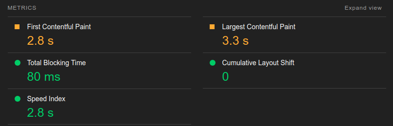
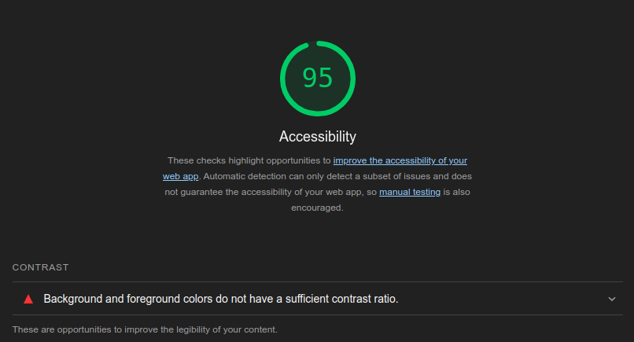
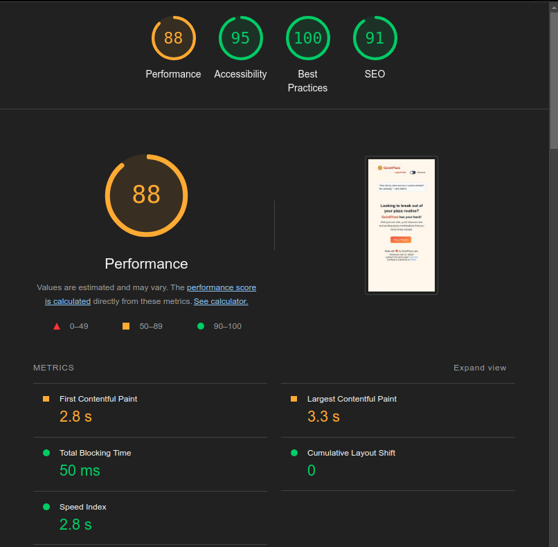
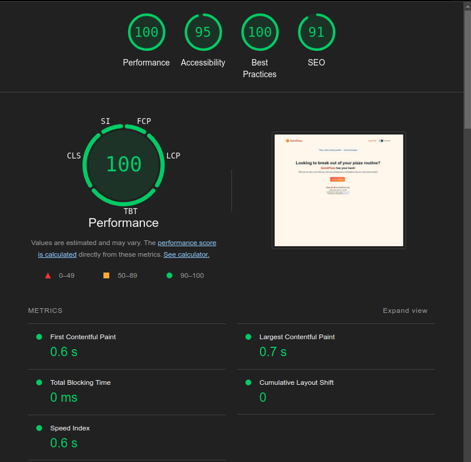

# Notes

## b)
Results report: [here](lighthouse_rebort_ex3b.pdf)

## c)

#### What metrics are contributing the most to the frontend perceived performance? What do they mean? 

Metrics:

- **First Contentful Paint**: First Contentful Paint marks the time at which the first text or image is painted. (contributed with worse score for performance)
- **Largest Contentful Paint**: Largest Contentful Paint marks the time at which the largest text or image is painted. (contributed with worse score for performance)
- **Total Blocking Time**: Sum of all time periods between FCP and Time to Interactive, when task length exceeded 50ms, expressed in milliseconds.
- **Cumulative Layout Shift**: Measures the movement of visible elements within the viewport. 
- **Speed Index**: Shows how quickly the contents of a page are visibly populated.

#### How would you make the site more accessible?
I would increase the contrast ratio between between background and foreground colors.

Indicator:

## d)
Results report: [here](lighthouse_report_ex3d.pdf)

Results show a slight improvement in performance. The total blocking time on this test was 50. The previous one was 80. An improvement of less 30 ms.

The difference was that noticeable probably because I don't use chrome and had to install it only for the exercise. So there was no cookies interfering on the first test.

## e)
Results report: [here](lighthouse_report_ex3e.pdf)

There was a huge improvement on performance using desktop tests. 100% score on performance now. The other fields stayed the same.

### Found the following reasons:

#### Hardware and software 
- Mobile devices have less processing power, memory, and storage than desktop computers.
- Mobile devices often use wireless networks, which can be less stable than wired connections.

#### Network connectivity 
- Mobile devices often use wireless networks, which can be less stable and have lower bandwidth than wired connections.

## f)

- **Performance**: Testing performance ensures your site loads quickly, enhancing user experience and engagement. 
- **Accessibility**: Accessibility testing ensures inclusivity, allowing all users, including those with disabilities, to navigate and use your site effectively. 
- **Best Practices**: Best practices improve site reliability, security, and maintainability. 
- **SEO Testing**: SEO testing boosts visibility on search engines, attracting more traffic and ensuring your content reaches the right audience. 

Each aspect contributes to a better, more impactful web presence!

## g)
These lighthouse tests were both made on incognito mode:

Results report on mobile mode: [here](lighthouse_report_site_ua_mobile.pdf)

Results report on desktop mode: [here](lighthouse_report_site_ua_desktop.pdf)