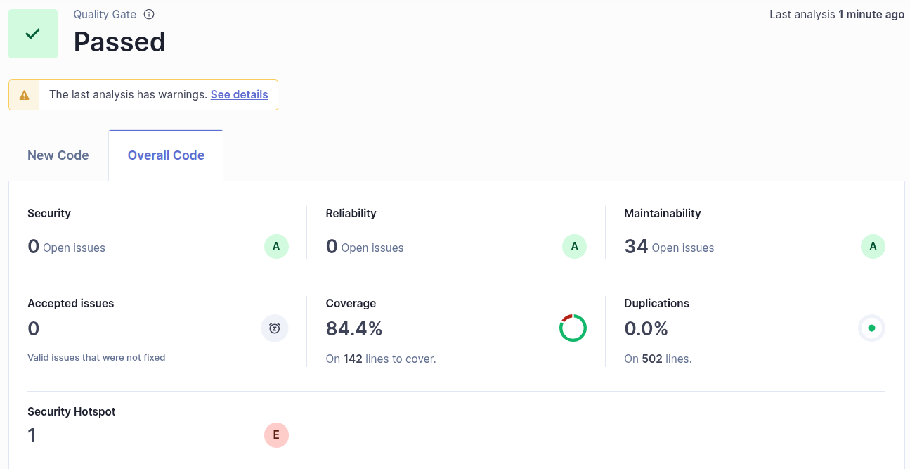

# Lab8

## Ex1
Token:
> Analyze "TQS_Lab8_1": sqp_deaf81e30007f9d391bd38d01150aaa52e5dea32

### d)
Static code analysis resuls:

- 

### f)
Static code analysis resuls:

My project passed the quality gate. 
Having the following scores:
- Security A (0 issues opened)
- Reliability A (0 issues opened)
- Maintainability A (34 issues opened)
- Coverage 84.9% 
- Duplications 0%
- Scurity Hotspot: 1 -> score: E

A security hotspot in static code analysis is a section of code that is more likely to have security risks.

### g)
| Issue |  Problem description  | How to solve |
|:---------------|:------------:|-------------:|
| Security       | not applicable     | not applicable   |
| Reliability    | not applicable      |   not applicable        |
| Maintainability| Remove this unused import 'java.security.NoSuchAlgorithmException'. (on Dip.java)   |   Just remove the import      |
| Security Hotspot| Make sure that using this pseudorandom number generator is safe here.    |    Use a cryptographically secure pseudo random number generator (CSPRNG) like "java.security.SecureRandom" in place of a non-cryptographic PRNG.
Use the generated random values only once.
You should not expose the generated random value. If you have to store it, make sure that the database or file is secure.
    |

### h)

#### Checkstyle

- Checks coding style and formatting rules.
- Works on source code.
- Enforces naming, spacing, and structure conventions.

#### PMD

- Detects bad practices and code quality issues.
- Works on source code.
- Flags unused variables, empty blocks, complex methods, etc.

SpotBugs

- Finds real bugs in code (runtime issues).
- Analyzes compiled bytecode.
- Detects null pointer issues, logic errors, performance flaws.

