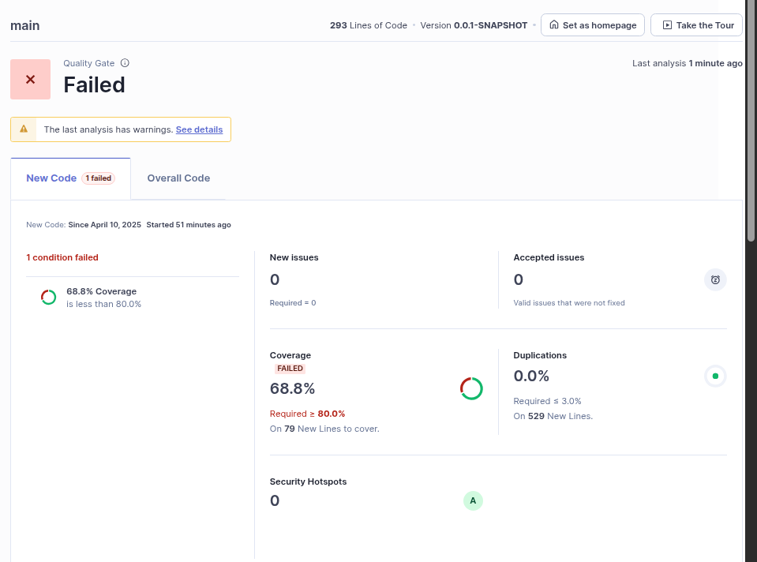

# Lab8_2Cars

## a) Add the jacoco dependency
```
<plugin>
    <groupId>org.jacoco</groupId>
    <artifactId>jacoco-maven-plugin</artifactId>
    <version>${jacoco-maven-plugin.version}</version>
    <executions>
        <execution>
            <goals>
                <goal>prepare-agent</goal>
            </goals>
        </execution>
        <execution>
            <id>report</id>
            <phase>test</phase>
            <goals>
                <goal>report</goal>
            </goals>
        </execution>
        <execution>
            <id>check</id>
            <phase>test</phase>
            <goals>
                <goal>check</goal>
            </goals>
            <configuration>
                <rules>
                    <rule>
                        <element>CLASS</element>
                    </rule>
                </rules>
            </configuration>
        </execution>
    </executions>
</plugin>
``` 

## b) SonarQube static analysis results


# c) 

Technical Debt: 5 min


# d)
I got 66% coverage.

Detailed:
- Lab32carsApplication.java
``` 
Cyclomatic Complexity: 1
Coverage: 33.3%
Uncovered Lines: 2
```

- CarController.java
```
Cyclomatic Complexity: 7
Coverage: 100%
Uncovered Lines: 0
```

- CarManagerService.java
```
Cyclomatic Complexity: 7
Coverage: 93.8%
Uncovered Lines: 1
```

- Car.java
```
Cyclomatic Complexity: 23
Coverage: 54.4%
Uncovered Lines: 16
````


The values are not good on Car.java and Lab32carsApplication (this one does not really matter).


# e)

- 1st Improvement

```
    /*
    Previous code.
    @Autowired
    private CarRepository carRepository;
    */

    private CarRepository carRepository;

    @Autowired
    public CarManagerService(CarRepository carRepository){
        this.carRepository = carRepository;
    }
```

- 2nd Improvement


``` 
Optional<Car> getCarReplacement(Car car){
        List<Car> allCars = this.getAllCars();

        //Criterio escolhido: carro tem de ser da mesma marca que o substitído.
        for (Car c : allCars){
            if (c.getMaker().equals(car.getMaker()) && c!=car){
                return Optional.of(c);
            }
        }
        return Optional.empty();
    }
``` 


Refactor to don't use persistent enity data type as parameter. Use of DTO.

```
    @PostMapping("/cars")
    ResponseEntity<Car> createCar(@RequestBody CarDTO carDTO){
        Car car = new Car(carDTO.getMaker(), carDTO.getModel());
        Car saved = carManagerService.save(car);
        return new ResponseEntity<>(saved, HttpStatus.CREATED);
    }
``` 

``` 
public class CarDTO {
    private String maker;
    private String model;
    public String getModel() {
        return model;
    }
    public void setModel(String model) {
        this.model = model;
    }
    public String getMaker() {
        return maker;
    }
    public void setMaker(String maker) {
        this.maker = maker;
    }
}
```

New Static analysis run


# f)

My project is passing the quality gate.


# g)
More flexible quality gate.

