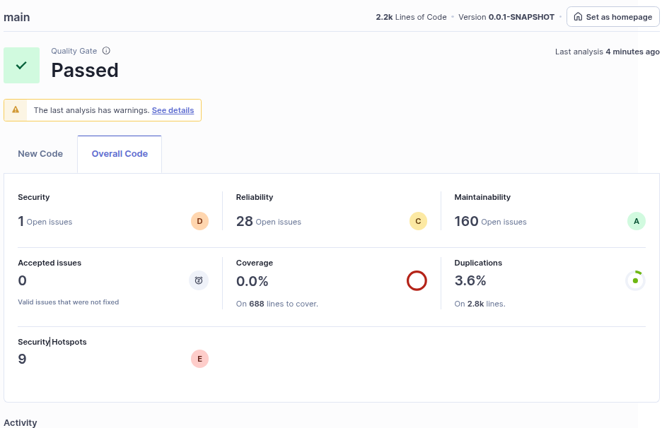
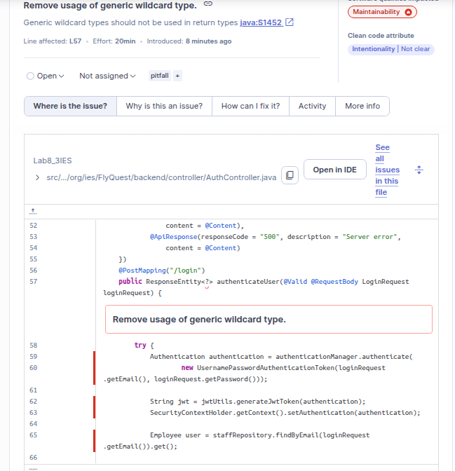
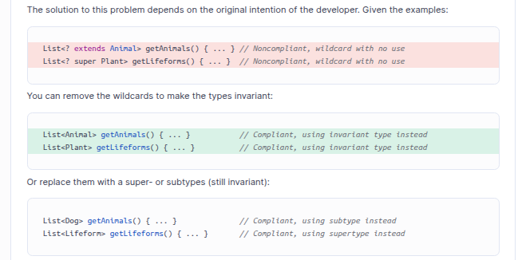
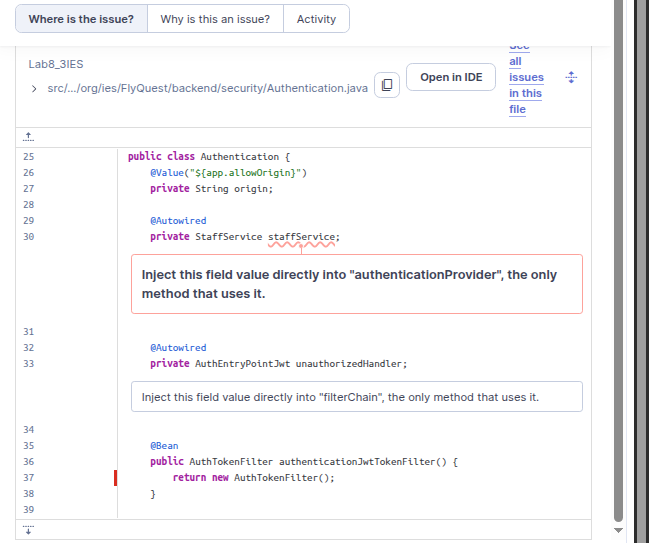
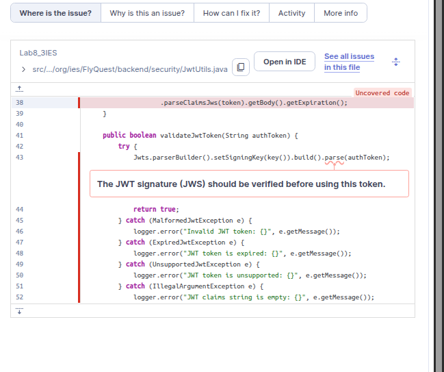
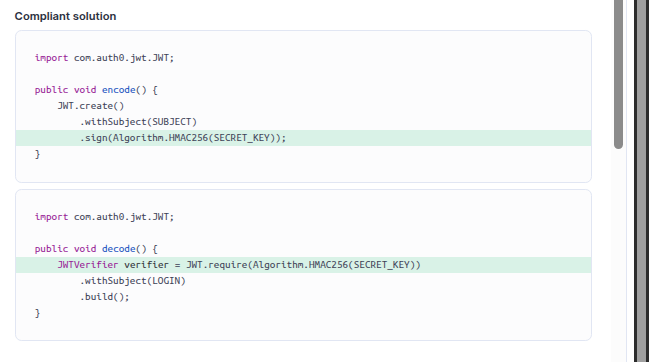
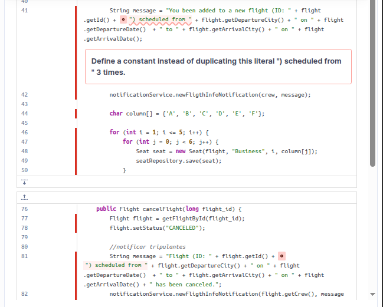
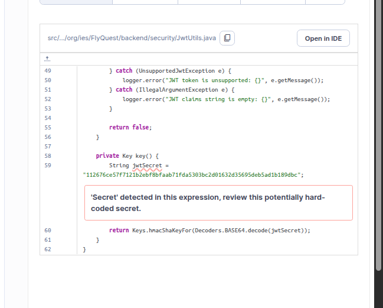

# Lab8_3

- 0 coverage, I applied 0 tests

- Good maintainability.
- Major security problems.
## Main issues

These are the main issues.
- 1

- 2

I thought this was the best practice, but with SonarQube I found out that I should initialize the service in the constructor and use @Autowired annotation on the constructor.

- 3

Best practice:

- 4

This was reported as a major issue but i don't think it was an issue at all. That variable would not have any value. We should look at this with critical thinking too.

## Security

Secrets on the code??? What were thinking half an year ago...
